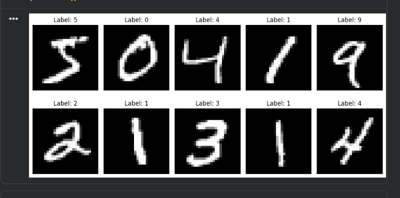
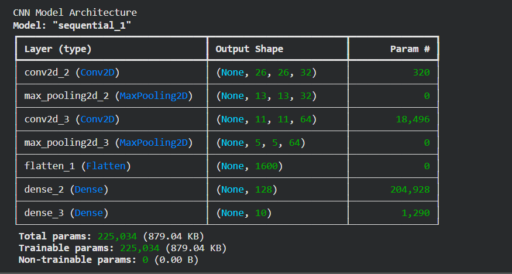
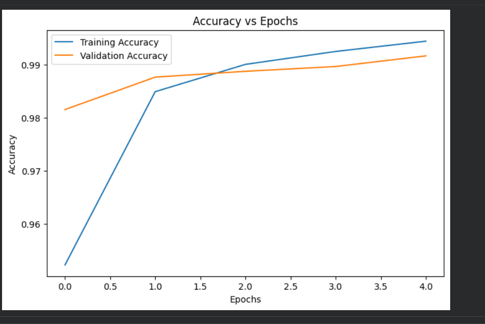
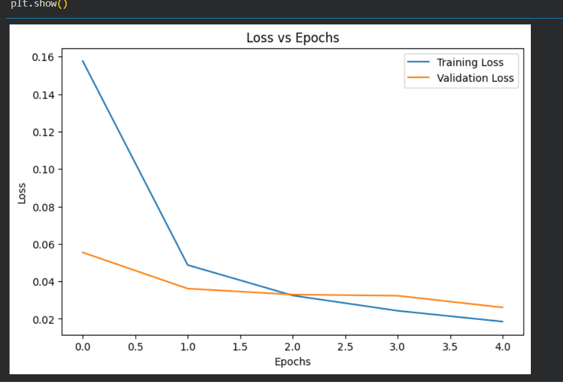
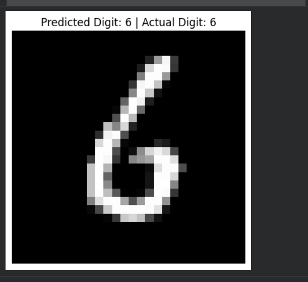

# Handwritten Digit Recognition using CNN

## Project Overview-

This project implements a Convolutional Neural Network (CNN) using TensorFlow and Keras to classify handwritten digits from the MNIST dataset.

The model learns to recognize digits from 0 to 9 and achieves over 99% test accuracy.

## Dataset

MNIST Handwritten Digits Dataset

- 70,000 grayscale images
- 28 × 28 pixels
- 10 classes (0–9)

Dataset loaded directly from TensorFlow.

## Technologies Used

- Python
- TensorFlow
- Keras
- NumPy
- Matplotlib
- Scikit-Learn

## How to Run

1. Clone the repository

git clone <repo-url>

2. Install dependencies

pip install -r requirements.txt

3. Run the notebook

jupyter notebook mnist_cnn.ipynb

## Data Loading

Training Images: 60,000

Testing Images: 10,000

### Dataset Sample

## Data Preprocessing

- Image Normalization
- Reshaping to 28×28×1
- One-Hot Encoding

## CNN Architecture

Architecture:

Conv2D (32 Filters)
↓
MaxPooling2D
↓
Conv2D (64 Filters)
↓
MaxPooling2D
↓
Flatten
↓
Dense (128)
↓
Dense (10 Softmax)

### Model Architecture

## Model Training

- Optimizer: Adam
- Loss Function: Categorical Crossentropy
- Epochs: 5
- Batch Size: 64

### Training Process

## Accuracy Graph

## Loss Graph

## Prediction Example

## Results

| Metric | Value |
|----------|----------|
| Test Accuracy | 99.16% |
| Test Loss | 0.026 |

## Key Learning Outcomes

- Deep Learning Fundamentals
- Convolutional Neural Networks (CNN)
- Image Classification
- TensorFlow & Keras
- Model Evaluation

## Future Improvements

- Data Augmentation
- Hyperparameter Tuning
- Deploy using Streamlit
- Support custom handwritten digit images

## Author

Nishi Chauhan

B.Tech Artificial Intelligence & Data Science
